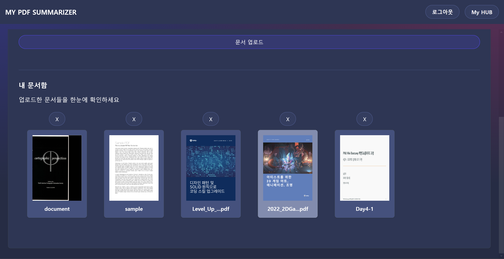
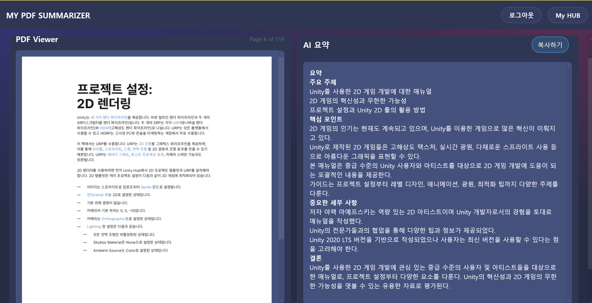

# PDF 자동 요약 프로그램
+ 발표자료 : [pdf 발표자료](./documents/미니_부트캠프_9조%20발표.pdf)

## 소개
이 프로그램은 PDF 파일의 내용을 자동으로 요약해주는 도구입니다. 사용자는 PDF 파일을 업로드하면, 프로그램이 주요 내용을 추출하여 간결한 요약본을 제공합니다.


## 주요 기능
- PDF 파일 업로드
- 텍스트 추출 및 분석
- 주요 내용 요약
- 요약본 복사


## 설치 방법
1. 저장소를 클론합니다:
    ```bash
    git clone https://github.com/yourusername/pdf-summary-tool.git
    ```
2. 필요한 패키지를 설치합니다:
    ```bash
    # 프론트엔드 패키지 설치
    cd frontend
    npm install

    # 백엔드 패키지 설치
    cd ../backend
    pip install -r requirements.txt
    ```

## 사용 방법

1. 프로그램을 실행합니다:
    ```bash
    # 프론트엔드 실행방법
    cd frontend
    npm run dev&

    # 백엔드 실행방법
    cd ../backend
    uvicorn main:app --host 0.0.0.0 --port 3031 --env-file .env --reload
    ```

2. 웹 브라우저에서 `http://localhost:8080`으로 접속합니다.

3. 회원가입 및 로그인을 진행합니다.


4. PDF 파일을 업로드합니다.


5. 문서를 클릭해 viewer를 엽니다.


6. 특정 페이지 영역을 선택해 요약을 생성합니다.



## 라이선스
이 프로젝트는 MIT 라이선스 하에 배포됩니다. 자세한 내용은 `LICENSE` 파일을 참조하세요.
